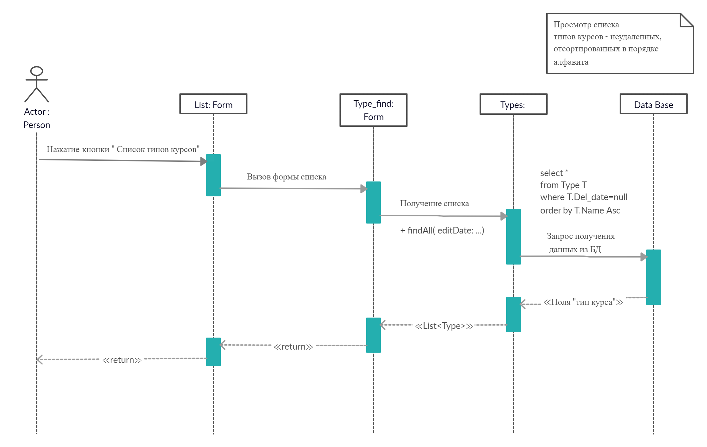
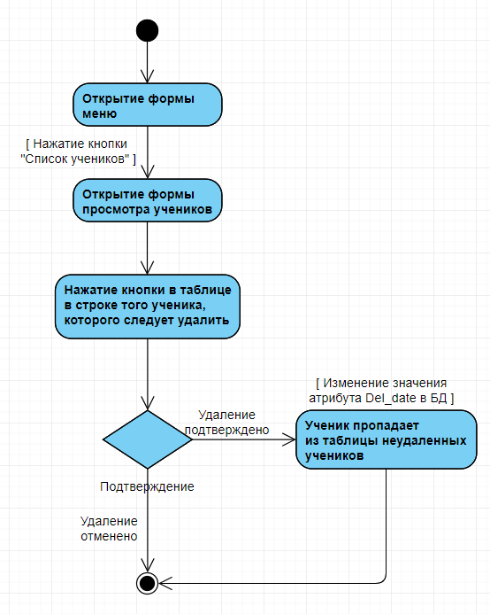
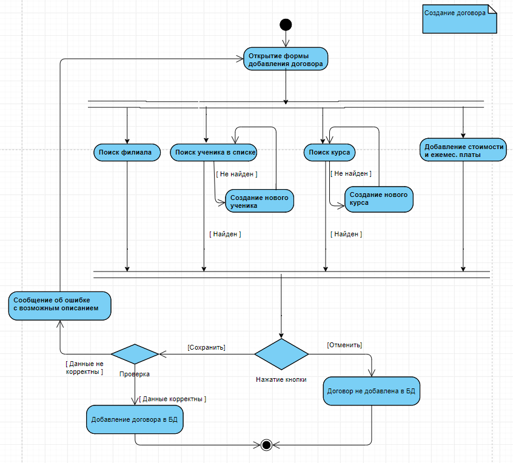

# Образовательный центр
## Описание миссии, задач разрабатываемого программного продукта:
Миссия программы - Автоматизация выполнения различных видов деятельности в образовательном центре для повышения эффективности работы центра и наблюдения за статистическими показателями центра для улучшения работы, эта программа позволяет более точно отслеживать данные об учениках: их успеваемость, посещаемость, домашние работы.
В ходе эксплуатации планируется решить следующие задачи:
-	контроль над финансовой деятельностью образовательного учреждения;
-	повышение эффективности функционирования образовательного центра в целом;
-	отслеживание успеваемости каждого ученика;
-	автоматизация ввода данных об учениках, сотрудниках, договорах;
-	упрощение создания и заключения договора об указании образовательных услуг в отличии от составления договора вручную;
-	просмотр расписания занятий;
-	просмотр и изменение договоров;
-	проведение анализа деятельности образовательного центра (формирование статистики за периоды времени).
 
 
## Диаграмма размещения

На диаграмме размещения изображены узлы выполнения программных компонентов, а также объектов. Таким образом, клиентское приложение, 
установленное на компьютере пользователя, взаимодействует с сервером, который содержит в себе базу данных.

## Диаграмма интерфейсов

Интерфейс служит для именования такого множества операций, а также для определения их сигнатур и результирующих действий.

### Список интерфейсов

- [IBranch](./docs/IBranch.md "Интерфейс IBranch")
- [ICabinet](./docs/ICabinet.md "Интерфейс ICabinet")
- [IContract](./docs/IContract.md "Интерфейс IContract")
- [ICourse](./docs/ICourse.md "Интерфейс ICourse")
- [IGrade](./docs/IGrade.md "Интерфейс IGrade")
- [IParent](./docs/IParent.md "Интерфейс IParent")
- [IPay](./docs/IPay.md "Интерфейс IPay")
- [IStudent](./docs/IStudent.md "Интерфейс IStudent")
- [ITheme](./docs/ITheme.md "Интерфейс ITheme")
- [ITimetable](./docs/ITimetable.md "Интерфейс ITimetable")
- [IType](./docs/IType.md "Интерфейс IType")
- [IVisit](./docs/IVisit.md "Интерфейс IVisit")
- [IWorker](./docs/IWorker.md "Интерфейс IWorker")

## Диаграмма классов

### Список классов

- [Branch](./docs/Branch.md "Класс Branch")
- [Cabinet](./docs/Cabinet.md "Класс Cabinet")
- [Contract](./docs/Contract.md "Класс Contract")
- [Course](./docs/Course.md "Класс Course")
- [Grade](./docs/Grade.md "Класс Grade")
- [Parent](./docs/Parent.md "Класс Parent")
- [Pay](./docs/Pay.md "Класс Pay")
- [Person](./docs/Person.md "Класс Person")
- [Student](./docs/Student.md "Класс Student")
- [Theme](./docs/Theme.md "Класс Theme")
- [Timetable](./docs/Timetable.md "Класс Timetable")
- [Type](./docs/Type.md "Класс Type")
- [Visit](./docs/Visit.md "Класс Visit")
- [Worker](./docs/Worker.md "Класс Worker")

## Диаграмма последовательностей

### Добавление ученика

Диаграмма описывает процесс добавления ученика. Пользователь нажимает на форме с таблицей учеников кнопку “Добавить”. Создается пустой экземпляр класса Student. Затем пользователь заполняет данные об ученике. Происходит присвоение данных полям класса, после чего вызывается функция Add(). Далее выполняется запрос к БД на добавление ученика. При успешном добавлении выводится сообщение, что ученик добавлен. 

### Добавление договора

Диаграмма описывает процесс добавления договора в БД. Пользователь нажимает на форме с таблицей договоров кнопку “Добавить”. Открывается форма редактирования данных о договоре. Создается пустой экземпляр класса Contract. Затем заполняются поля формы данными о менеджере, заполняется выпадающий список филиалов, и управление передается пользователю. Пользователь заполняет данные о договоре. Пользователю предлагается выбрать ученика из формы списка учеников и курс из формы списка курсов, предварительно по средствам запроса к БД формируются эти списки. После того, как пользователь выбрал ученика и курс, происходит присвоение данных полям класса, после чего вызывается функция Add(). После этого выполняется запрос на добавление договора в БД. При успешном добавлении выводится сообщение, что договор добавлен.

### Просмотр списка типов курсов

Диаграмма описывает процесс просмотра списка типов курсов. Пользователь нажимает на главной форме кнопку “Типы курсов”, затем вызывается форма списка типов курсов, в которой выполняется функция получения списка. Из класса «Types» выполняется запрос к БД на получение списка. Далее показывается список типов курсов с заданными условиями   поиска и сортировки.

### Другие диаграммы: 
-  [удаление ученика](./docs/DelStudent.md "Диаграмма последовательностей - удаление ученика")
-  [редактирование данных об ученике](./docs/EditStudent.md "Диаграмма последовательностей -  редактирование данных об ученике")
-  [добавление ответственного лица](./docs/AddParent.md "Диаграмма последовательностей - добавление ответственного лица")

## Диаграмма действий

### Удаление ученика

Диаграмма действий описывает удаление ученика в БД. Пользователь в списке выбирает ученика, которого стоит удалить.  Появляется окно, в котором пользователь подтверждает свои действия - «Отменить» или «Подтвердить». В соответствие с тем, какая кнопка была нажата, выполняются соответствующие действия. При удалении ученик не удаляется из БД, а у него меняется атрибут Deldate.

### Добавление договора

Диаграмма действий описывает добавление договора. После открытия формы добавления пользователь может выбрать какие данные из 4 возможных он будет заполнять первоначально – для этого на диаграмме представлена линейка синхронизации. После заполнения полей пользователь может нажать одну из двух кнопок: «Отменить» или «Сохранить». 

### Другие диаграммы:
-  [добавление работника](./docs/AddWorker.md "Диаграмма действий - добавление работника")
-  [изменение оценки](./docs/EditGrade.md "Диаграмма действий - изменение оценки")

## Диаграмма состояний
[Диаграмма состояний] (./docs/State.md "Диаграммы состояний")
