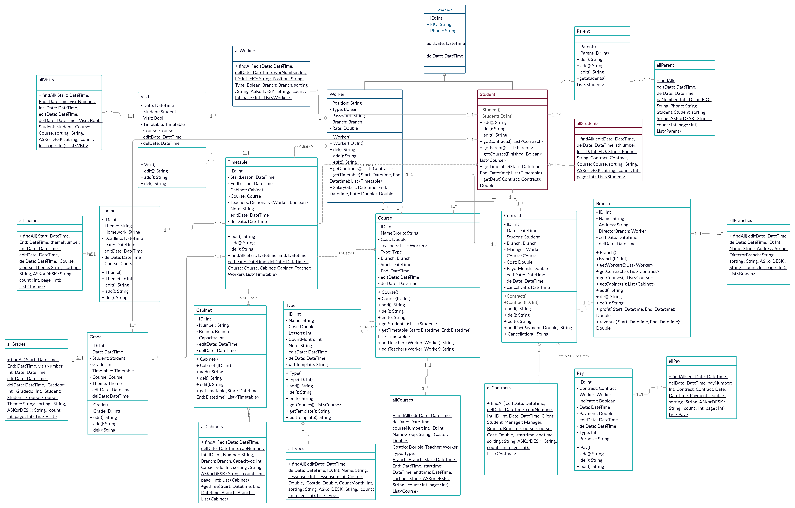

# Образовательный центр
## Диаграмма размещения

На диаграмме размещения изображены узлы выполнения программных компонентов, а также объектов. Таким образом, клиентское приложение, 
установленное на компьютере пользователя, взаимодействует с сервером, который содержит в себе базу данных.

## Диаграмма интерфейсов

### Список интерфейсов

- [IBranch](https://github.com/ "Интерфейс IBranch")
- [ICabinet](https://github.com/ "Интерфейс ICabinet")
- [IContract](https://github.com/ "Интерфейс IContract")
- [ICourse](https://github.com/ "Интерфейс ICourse")
- [IGrade](https://github.com/ "Интерфейс IGrade")
- [IParent](https://github.com/ "Интерфейс IParent")
- [IPay](https://github.com/ "Интерфейс IPay")
- [IStudent](https://github.com/ "Интерфейс IStudent")
- [ITheme](https://github.com/ "Интерфейс ITheme")
- [ITimetable](https://github.com/ "Интерфейс ITimetable")
- [IType](https://github.com/ "Интерфейс IType")
- [IVisit](https://github.com/ "Интерфейс IVisit")
- [IWorker](https://github.com/ "Интерфейс IWorker")

Интерфейс служит для именования такого множества операций, а также для определения их сигнатур и результирующих действий.

## Диаграмма классов

### Список классов

- [Branch](https://github.com/ "Класс Branch")
- [Cabinet](./docs/Cabinet.md "Класс Cabinet")
- [Contract](https://github.com/ "Класс Contract")
- [Course](https://github.com/ "Класс Course")
- [Grade](https://github.com/ "Класс Grade")
- [Parent](https://github.com/ "Класс Parent")
- [Pay](https://github.com/ "Класс Pay")
- [Person](https://github.com/ "Класс Person")
- [Student](https://github.com/ "Класс Student")
- [Theme](https://github.com/ "Класс Theme")
- [Timetable](https://github.com/ "Класс Timetable")
- [Type](https://github.com/ "Класс Type")
- [Visit](https://github.com/ "Класс Visit")
- [Worker](https://github.com/ "Класс Worker")

## Диаграмма последовательностей

### Добавление ученика

Диаграмма описывает процесс добавления ученика. Пользователь нажимает на форме с таблицей учеников кнопку “Добавить”. Создается пустой экземпляр класса Student. Затем пользователь заполняет данные об ученике. Происходит присвоение данных полям класса, после чего вызывается функция Add(). Далее выполняется запрос к БД на добавление ученика. При успешном добавлении выводится сообщение, что ученик добавлен. 

### Добавление договора

Диаграмма описывает процесс добавления договора в БД. Пользователь нажимает на форме с таблицей договоров кнопку “Добавить”. Открывается форма редактирования данных о договоре. Создается пустой экземпляр класса Contract. Затем заполняются поля формы данными о менеджере, заполняется выпадающий список филиалов, и управление передается пользователю. Пользователь заполняет данные о договоре. Пользователю предлагается выбрать ученика из формы списка учеников и курс из формы списка курсов, предварительно по средствам запроса к БД формируются эти списки. После того, как пользователь выбрал ученика и курс, происходит присвоение данных полям класса, после чего вызывается функция Add(). После этого выполняется запрос на добавление договора в БД. При успешном добавлении выводится сообщение, что договор добавлен.
### Другие диаграммы:
- [добавление договора](https://github.com/ "Диаграмма последовательностей - добавление договора")
-  [удаление ученика](https://github.com/ "Диаграмма последовательностей - удаление ученика")
-  [просмотр типов курсов](https://github.com/ "Диаграмма последовательностей - просмотр типов курсов")
- [ редактирование данных об ученике](https://github.com/ "Диаграмма последовательностей -  редактирование данных об ученике")
-  [добавление ответственного лица](https://github.com/ "Диаграмма последовательностей - добавление ответственного лица")

## Диаграмма действий
-  [добавление работника](https://github.com/ "Диаграмма действий - добавление работника")
-  [удаление ученика](https://github.com/ "Диаграмма действий - удаление ученика")
-  [изменение оценки](https://github.com/ "Диаграмма действий - изменение оценки")
-  [создание договора](https://github.com/ "Диаграмма действий - создание договора")

## Диаграмма состояний
-  [состояние договора](https://github.com/ "Диаграмма состояний - состояние договора")
-  [состояние курса](https://github.com/ "Диаграмма состояний - состояние курса")