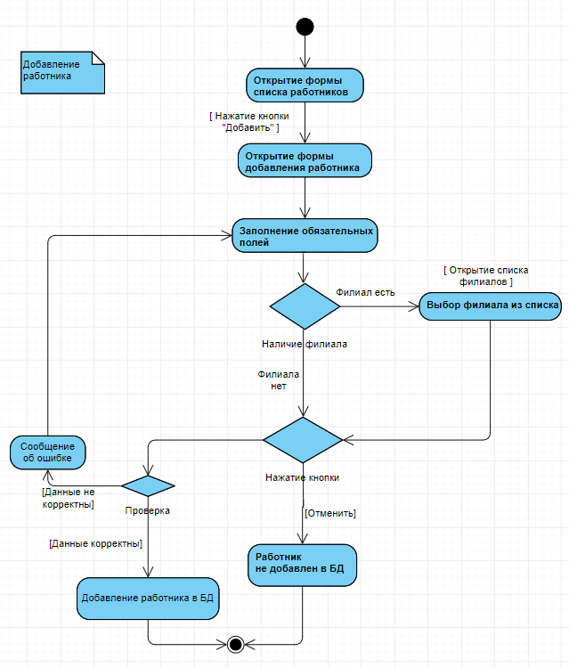

# Добавление работника

Диаграмма действий описывает добавление работника в БД. После открытия формы добавления пользователь заполняет поля. Если пользователь планирует заполнять поле «Филиал», то выбирает из существующих, если нет, то просто пропускает это поле и оставляет его пустым. После заполнения полей пользователь может нажать одну из двух кнопок: «Отменить» или «Сохранить». В соответствие с тем, какая кнопка была нажата, выполняются соответствующие действия. Если при проверке возникает какая-либо ошибка, пользователь получает уведомление об этом и ему предлагается изменение значений полей.