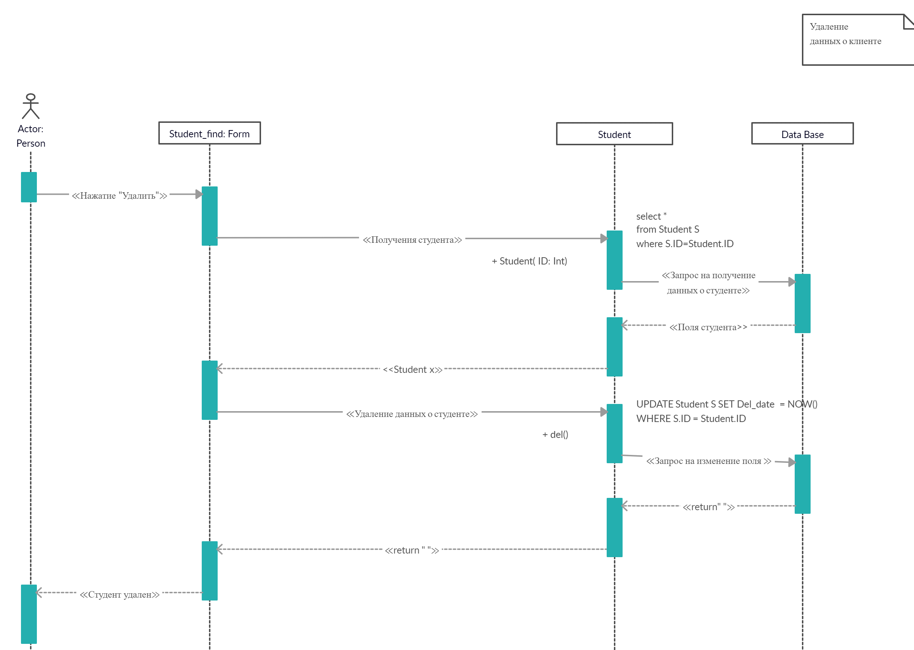

# Удаление ученика

Диаграмма описывает процесс удаление данных ученика. Пользователь нажимает на форме с таблицей учеников кнопку “Удалить”. Вызывается функция Student(ID: Int). Затем вызывается функция Del() для удаления клиента из программы. Выполняется запрос на изменение поля клиента Del_date в базе данных. При успешном выполнении выводится сообщение, что ученик удален.