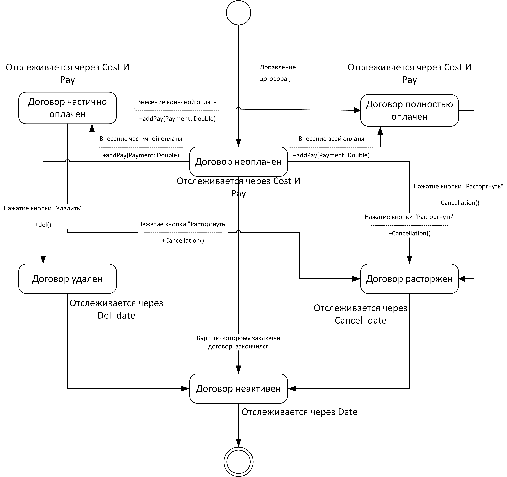
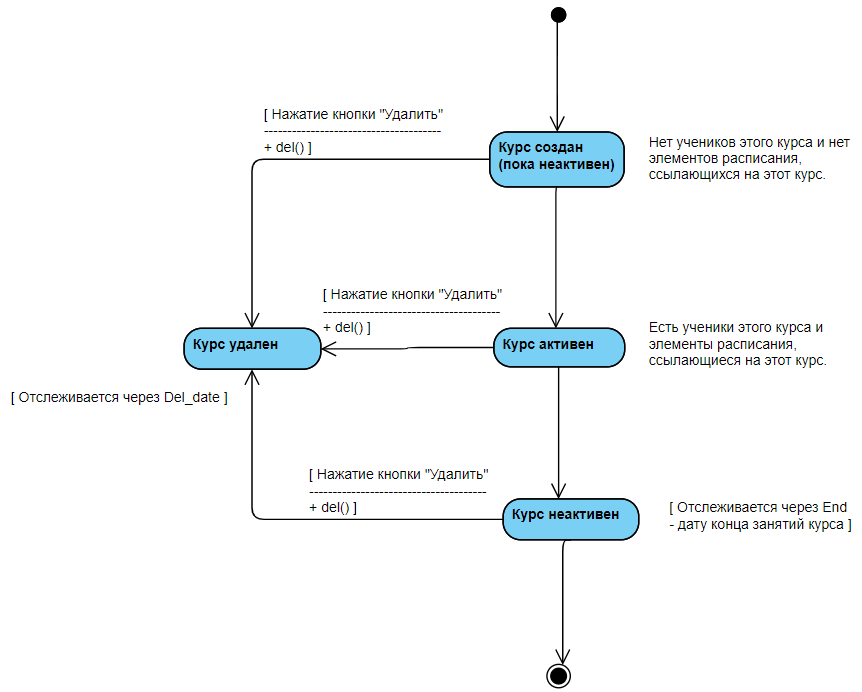

# Состояние договора

Диаграмма описывает все возможные состояния договора на продолжении его жизненного цикла. Сначала договор создается и находится в состоянии неоплаченного. После внесения оплаты договор может стать частично оплаченным или оплаченным полностью. Из состояний оплачен частично, оплачен полностью или не оплачен договор может перейти в состояние «расторжения». Из состояния «не оплачен» договор может перейти в «удален». После того, как сроки обучения, на которые был записан курс проходят, или договор расторжен, или договор удален – договор становится неактивным. Последнее состояние договора «неактивен».

# Состояние курса

Диаграмма описывает все возможные состояния курса на продолжении его жизненного цикла. Сначала курс создается, потом он может стать активным или удаленным.  После того, как сроки обучения, на которые был записан курс проходят – курс становится неактивным. Последнее состояние курса «неактивен».